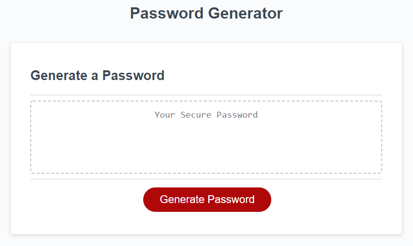

# Password Generator

## Purpose
This is a password generator web application built with HTML, CSS, and JavaScript. The user is presented with a series of window prompts of which values they want (special, uppercase/lowercase, and numeric characters) to include in the password. Once the options have been selected, the password is generated to the webpage.

## Built With
* HTML
* CSS
* JavaScript

## Website
https://thevcr.github.io/password-generator

